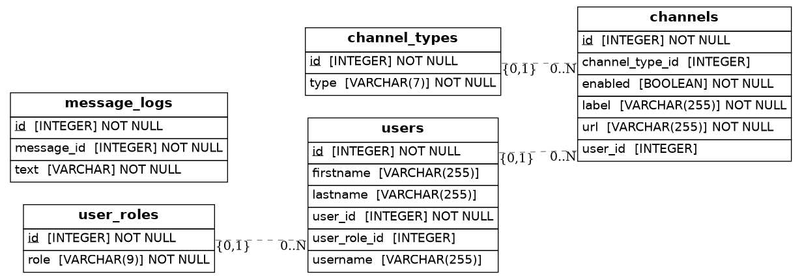

# telegram-stream-notifier-bot (former telegram-youtube-notifier-bot)

> ⚠️ Warning: project is still under development, use with caution.

Simple LiveStreams notifier in telegram based on [aiogram](https://github.com/aiogram/aiogram), [aiogram-dialog](https://github.com/Tishka17/aiogram_dialog)  and [aps-schedule](https://github.com/agronholm/apscheduler).

### Available platforms

| Platform | Based on                                             | Status                                               |
|----------|------------------------------------------------------|------------------------------------------------------|
| Youtube  | [youtube-dlp](https://github.com/yt-dlp/yt-dlp)      | ✅                                                    |
| Twitch   | [twitch-api](https://github.com/Teekeks/pyTwitchAPI) | ✅                                                    |
| Kick     | [aiohttp](https://github.com/aio-libs/aiohttp)          | ❌ [#114](https://github.com/bralbral/telegram-stream-notifier/issues/114)|

Use this bot to receive periodic reports on live broadcasts on stream platforms and generate and send the report to telegram. 

## Features

1. Generating a custom report using [jinja](https://github.com/pallets/jinja).

2. Administration of channels (adding/disabling/deleting) through telegram windows using [aiogram-dialog](https://github.com/Tishka17/aiogram_dialog).

3. Regularly checking active channels using [aps-schedule](https://github.com/agronholm/apscheduler).

4. Getting information about streams using packages from [list](#Available-platforms).

## Commands

| Command         | Scope     | Description                                                          |
|-----------------|-----------|----------------------------------------------------------------------|
| add_channel     | User      | Add youtube channel                                                  |
| channels        | User      | Channels Administration                                              |
| cancel          | User      | Clear current fsm-state (if error)                                   |
| add_user        | Superuser | Add user                                                             |
| scheduler_start | Superuser | Start scheduling periodic tasks of fetching information about streams |
| scheduler_pause | Superuser | Pause scheduling periodic tasks of fetching information about streams |

## Database schema

## Deploy

### Install from source

> Tested on Ubuntu 22.04, python 3.12

Just copy source code:

`git clone https://github.com/bralbral/telegram-stream-notifier.git`

Install requirements:

`pip install -r requirements.txt`

Fill [config.yml](./deploy/example.config.yaml) and place it to root dir. (In parent dir to `src`)

Run:

`python3 -m src`

### Install with Docker

> Stable release with `main` tag on [dockerhub](https://hub.docker.com/r/bral1488/telegram-youtube-notifier/tags)

Just copy [docker-compose.yml](./deploy/docker/example.docker-compose.yml) and fill in  [config.yaml](./deploy/example.config.yaml).

Run containers:

`docker-compose up -d` or if you have new docker `docker compose up -d`

Of course, you can build image yourself:

Just copy source code:

`git clone https://github.com/bralbral/telegram-stream-notifier.git`

and build docker image:

`docker build -t <your_image_name>:<your_tag_name>`

And use this image with [docker-compose.yml](./deploy/example.docker-compose.yml) from `deploy` dir.

### Install with k8s

> Stable release with `main` tag on [dockerhub](https://hub.docker.com/r/bral1488/telegram-youtube-notifier/tags)

Manifests located in [k8s](deploy%2Fk8s) directory.

It consists of `Namespace`, `ConfigMap`, `PersistenVolume`, `PersistentVolumeClaim`, and `Deployment` files.

You need fill sections in  [01_configmap.yaml](deploy%2Fk8s%2F01_configmap.yaml) and [02_persistent_volume.yaml](deploy%2Fk8s%2F02_persistent_volume.yaml) files.

> ⚠️ Deployment use `storageClassName: local-path`. A detailed description can be found [here](https://kubernetes.io/docs/concepts/storage/storage-classes/#local)  

Apply deployment:

`kubectl apply -f <directory with configs>`

Or you can do it step by step:

`kubectl apply -f <file from config dir>`

## Setup Cookies for Youtube

You can use own cookies for yt-dlp extractors.

Just install [Get cookies.txt](https://chromewebstore.google.com/detail/cclelndahbckbenkjhflpdbgdldlbecc) and extract cookies in **Netscape HTTP Cookie File format**.

## Hosting
You can rent a server from various hosters, for example from [Aeza](https://aeza.net/?ref=380831).

>*By registering via the [link](https://aeza.net/?ref=380831) you will support the project and receive a 15% bonus on your balance, which will be valid for 24 hours.*

The bot will require the simplest VDS, in rubles this is approximately 100-200 for promotional offers, or about 500 rubles per month.

## Develop and Contribute

Feel free to create issue or pull request.

For development, you should install the requirements from [requirements_dev.txt](./requirements_dev.txt)

`pip install -r requirements_dev.txt`

Use [pre-commit.sh](./pre-commit.sh) before commit.
